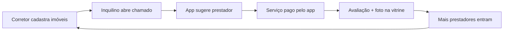

# Zelo

> Gestão de aluguel + marketplace de manutenção num app só.

O Zelo ajuda corretores autônomos e pequenos proprietários a gerenciar seus imóveis alugados e a resolver problemas de manutenção. Quando algo quebra, o inquilino abre um chamado pelo WhatsApp e o app sugere prestadores da região com preço, avaliações reais e pagamento protegido.

> **Status:** em desenvolvimento, na fase 1 do MVP. Nome provisório.

---

## Por que existe

- Corretores controlam contratos, cobranças e repasses em planilhas e grupos de WhatsApp.
- Quando algo quebra, o prestador é encontrado por indicação, sem preço de referência nem garantia.
- Prestadores bons dependem do boca a boca ou pagam por leads que não fecham.

No Zelo, a gestão de aluguel gera a demanda do marketplace. Cada imóvel cadastrado vira uma fonte recorrente de chamados.



## Perfis de usuário

| Perfil | Acesso | O que faz |
| --- | --- | --- |
| Corretor / proprietário | App + web | Gerencia imóveis, contratos, cobranças, repasses e chamados |
| Inquilino | Link no WhatsApp (sem instalar app) | Abre chamados com foto, paga o aluguel, acompanha status |
| Prestador | App | Define preços, recebe serviços, posta fotos de trabalhos |
| Cliente avulso | App + web pública | Busca prestadores no mapa e contrata |

## Funcionalidades

### Gestão de aluguel
- Cadastro de imóveis, inquilinos e contratos
- Painel com imóveis ocupados e vagos, aluguéis a receber, inadimplentes e chamados abertos
- Chamados pelo link do inquilino, com triagem por IA (categoria e urgência)
- Histórico do imóvel: o que quebrou, quem consertou, quanto custou, garantia
- Alertas de vencimento e reajuste de contrato
- Reajuste automático por IGP-M ou IPCA *(fase 3)*
- Cobrança via Pix com régua de atraso *(fase 3)*
- Repasse ao proprietário com desconto de taxa e manutenções *(fase 3)*
- Vistoria de entrada e saída com fotos *(fase 3)*

### Marketplace de manutenção
- Catálogo de serviços padronizados com preço definido por cada prestador
- Busca no mapa por serviço e região
- Card do prestador com nota, nº de serviços, preços, raio e disponibilidade
- Avaliações só de quem contratou pelo app
- Pagamento protegido: o valor só é liberado após a confirmação do serviço
- Selo de verificado (documento e antecedentes)

### Vitrine de serviços
- Feed estilo rede social com fotos de trabalhos feitos, filtrado por região e categoria
- Posts ligados a serviços pagos pelo app recebem o selo **Serviço verificado**
- Portfólio no perfil do prestador
- Botão "Quero um serviço assim" que leva direto à contratação

## Roadmap

- [ ] **Fase 1: Gestão + chamados.** Imóveis e contratos, painel, link do inquilino, triagem por IA, prestadores cadastrados manualmente, histórico por imóvel
- [ ] **Fase 2: Marketplace + vitrine.** Mapa, catálogo de preços, avaliações, pagamento protegido, feed de fotos
- [ ] **Fase 3: Financeiro do aluguel.** Cobrança Pix, reajuste por índice, vistoria, repasse
- [ ] **Fase 4: App do prestador.** Agenda, carteira, destaque pago

## Stack (proposta)

| Camada | Tecnologia |
| --- | --- |
| App mobile (corretor / prestador) | React Native (Expo) |
| Web (link do inquilino, busca pública) | Next.js |
| Backend e banco | Supabase (Postgres + Auth + Storage) com PostGIS |
| Mapas | Google Maps ou Mapbox |
| Triagem de chamados | LLM com visão |
| Pagamentos | Gateway com Pix, split e custódia |
| Notificações | WhatsApp Business API, push e e-mail |

> A stack ainda está em definição. Atualize esta seção quando as escolhas forem fechadas.

## Como rodar

> Em breve. Esta seção será preenchida quando o primeiro código for adicionado ao repositório.

```bash
git clone <url-do-repo>
cd zelo
# instruções de instalação e execução
```

## Documentação

- [PRD completo (PDF)](PRD-Zelo.pdf)
- [PRD completo (Word)](PRD-Zelo.docx)

## Licença

A definir.
